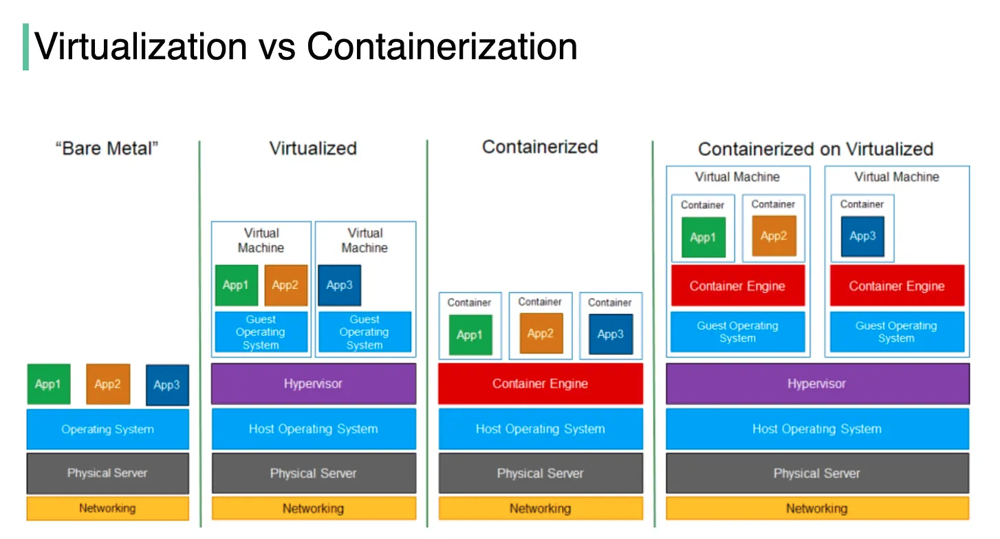

# docker

**What is Docker :**

- Docker is a set of platform as a service (PaaS) products that use OS-level virtualization to deliver software in packages called containers.   
- The software that hosts the containers is called Docker Engine.   
- It was first released in 2013 and is developed by Docker, Inc.    

Docker is a tool that is used to automate the deployment of applications in lightweight containers so that applications can work efficiently in different environments in isolation.

**What is Hypervisor**
 - A hypervisor is software or firmware that allows you to create and manage operating systems (called guest OSes) to run simultaneously on a single physical machine (called the host).
 - It acts as a middle layer that allocates hardware resources (cpu, memory, storage) to each VM, ensuring the operate independently.

*example -*
  1. VMware - VMware ESXI
  2. Microsoft - Hyper-V
  3. Oracle - Oracle VM and Virtualbox
  4. Citrix - Xenserver

*Types of Hypervisor :*

1. Bare-Metal Hypervisor
  - Runs directly on physical hardware without a host operating system
  - Used in data centers and enterprise environments.
    
*example -*
  1. VMware - VMware ESXI
  2. Microsoft - Hyper-V
  3. Oracle - Oracle VM and Virtualbox

2. Hosted Hypervisor
  - Runs on an existing operating system and acts as an application
  - Used for developement and testing on personal computers
*example -*
1. Oracle - Oracle VM and Virtualbox
