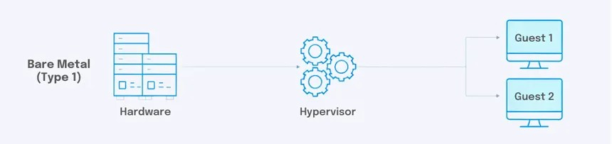
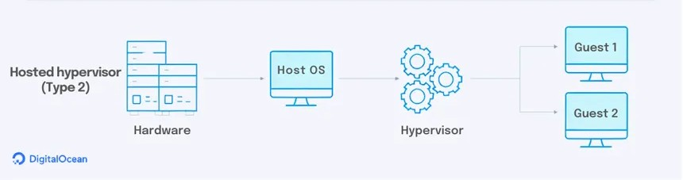

# docker

**What is Docker :**

- Docker is a set of platform as a service (PaaS) products that use OS-level virtualization to deliver software in packages called containers.  <br>
- The software that hosts the containers is called Docker Engine.  <br>
- It was first released in 2013 and is developed by Docker, Inc.   <br>
- Common use cases: Microservices, testing, CI/CD, dev environments, etc. <br>

Docker is a tool that is used to automate the deployment of applications in lightweight containers so that applications can work efficiently in different environments in isolation.


**What is Contenerization**

Containerization is a lightweight form of virtualization that involves packaging an application and all its dependencies (libraries, config files, etc.) into a single unit called a container.

🧱 Key Concepts:

```ssh
| Concept           | Description                                                                  |
| ----------------- | ---------------------------------------------------------------------------- |
|   Container       | A running instance of a Docker **image** (like a virtual environment).       |
|   Image           | A snapshot/template used to create containers. Think of it like a blueprint. |
|   Docker Engine   | The core service that runs and manages containers.                           |
```

🚀 *What Makes Containers Special?*
 - Isolated: Each container runs independently with its own filesystem, network, and process space.
 - Lightweight: Containers share the host system’s kernel, so they use fewer resources than virtual machines.
 - Portable: You can build a container once and run it anywhere (local machine, server, cloud).
 - Fast: Containers start and stop almost instantly.

🛠️ *Example Workflow:*
1. Pull an image:

```
docker pull nginx
```

2. Run a container:

```
docker run -d --name spider -p 80:80 nginx
```
This runs the NGINX web server inside a Docker container.

3. List running containers:

```ssh
docker ps
```

<hr>

**What is Hypervisor**
 - A hypervisor is software or firmware that allows you to create and manage operating systems (called guest OSes) to run simultaneously on a single physical machine (called the host).
 - It acts as a middle layer that allocates hardware resources (cpu, memory, storage) to each VM, ensuring the operate independently.

*example -*
  1. VMware - VMware ESXI
  2. Microsoft - Hyper-V
  3. Oracle - Oracle VM and Virtualbox
  4. Citrix - Xenserver

*Types of Hypervisor :*

1. Bare-Metal Hypervisor
  - Runs directly on physical hardware without a host operating system
  - Used in data centers and enterprise environments.
    
*example -*
 - VMware - VMware ESXI
 - Microsoft - Hyper-V
 - Citrix - Xenserver

 

2. Hosted Hypervisor
  - Runs on an existing operating system and acts as an application
  - Used for developement and testing on personal computers
    
*example -*
 - Oracle - Oracle VM and Virtualbox



<hr>

📦 **What Is a Docker Volume ?**  <br>
A Docker volume is a persistent storage mechanism used by Docker containers to store data outside the container's writable layer, making the data last even if the container is stopped, recreated, or deleted.

In Docker, containers are ephemeral by default — when you delete a container, its data is lost. Volumes solve this by creating a separate storage area managed by Docker, mounted into containers for:
 - Persisting application data
 - Sharing data between containers
 - Backing up/Restoring container data

*Types of Docker Volume* <br>
🔸 1. Bind Mount  <br>
🔹 2. Docker Volume  <br>

🔸 1. Bind Mount
Definition: A bind mount maps a specific file or directory on the host into the container.
✅ Characteristics:  <br>
 - You specify the exact path on the host.
 - The file/directory must already exist on the host (or be created manually).
 - Useful for local development (e.g., sharing source code into a container).
