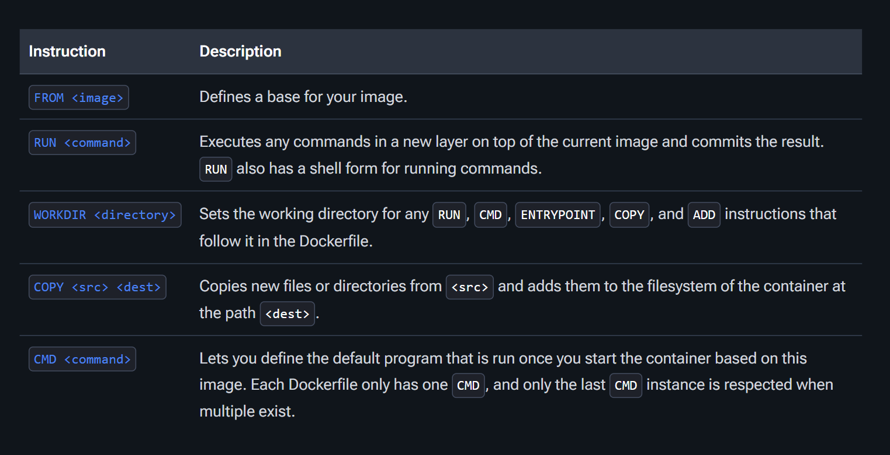

# docker

**What is Docker :**

- Docker is a set of platform as a service (PaaS) products that use OS-level virtualization to deliver software in packages called containers.  <br>
- The software that hosts the containers is called Docker Engine.  <br>
- It was first released in 2013 and is developed by Docker, Inc.   <br>
- Common use cases: Microservices, testing, CI/CD, dev environments, etc. <br>

Docker is a tool that is used to automate the deployment of applications in lightweight containers so that applications can work efficiently in different environments in isolation.


**What is Contenerization**

Containerization is a lightweight form of virtualization that involves packaging an application and all its dependencies (libraries, config files, etc.) into a single unit called a container.

🧱 Key Concepts:

```ssh
| Concept           | Description                                                                  |
| ----------------- | ---------------------------------------------------------------------------- |
|   Container       | A running instance of a Docker **image** (like a virtual environment).       |
|   Image           | A snapshot/template used to create containers. Think of it like a blueprint. |
|   Docker Engine   | The core service that runs and manages containers.                           |
```

🚀 *What Makes Containers Special?*
 - Isolated: Each container runs independently with its own filesystem, network, and process space.
 - Lightweight: Containers share the host system’s kernel, so they use fewer resources than virtual machines.
 - Portable: You can build a container once and run it anywhere (local machine, server, cloud).
 - Fast: Containers start and stop almost instantly.

<hr>
Docker-Installtion
```ssh
# Add Docker's official GPG key:
sudo apt-get update
sudo apt-get install ca-certificates curl
sudo install -m 0755 -d /etc/apt/keyrings
sudo curl -fsSL https://download.docker.com/linux/ubuntu/gpg -o /etc/apt/keyrings/docker.asc
sudo chmod a+r /etc/apt/keyrings/docker.asc
# Add the repository to Apt sources:
echo \
  "deb [arch=$(dpkg --print-architecture) signed-by=/etc/apt/keyrings/docker.asc] https://download.docker.com/linux/ubuntu \
  $(. /etc/os-release && echo "${UBUNTU_CODENAME:-$VERSION_CODENAME}") stable" | \
  sudo tee /etc/apt/sources.list.d/docker.list > /dev/null
sudo apt-get update
sudo apt-get install docker-ce docker-ce-cli containerd.io docker-buildx-plugin docker-compose-plugin
```

<hr>

🛠️ *Example Workflow:*
1. Pull an image:

```
docker pull nginx
```

2. Run a container:

```
docker run -d --name spider -p 80:80 nginx
```
This runs the NGINX web server inside a Docker container.

3. List running containers:

```ssh
docker ps
```

<hr>

**What is Hypervisor**
 - A hypervisor is software or firmware that allows you to create and manage operating systems (called guest OSes) to run simultaneously on a single physical machine (called the host).
 - It acts as a middle layer that allocates hardware resources (cpu, memory, storage) to each VM, ensuring the operate independently.

*example -*
  1. VMware - VMware ESXI
  2. Microsoft - Hyper-V
  3. Oracle - Oracle VM and Virtualbox
  4. Citrix - Xenserver

*Types of Hypervisor :*

1. Bare-Metal Hypervisor
  - Runs directly on physical hardware without a host operating system
  - Used in data centers and enterprise environments.
    
*example -*
 - VMware - VMware ESXI
 - Microsoft - Hyper-V
 - Citrix - Xenserver

 

2. Hosted Hypervisor
  - Runs on an existing operating system and acts as an application
  - Used for developement and testing on personal computers
    
*example -*
 - Oracle - Oracle VM and Virtualbox


<hr>

📦 **What Is a Docker Volume ?**  <br>
A Docker volume is a persistent storage mechanism used by Docker containers to store data outside the container's writable layer, making the data last even if the container is stopped, recreated, or deleted.

In Docker, containers are ephemeral by default — when you delete a container, its data is lost. Volumes solve this by creating a separate storage area managed by Docker, mounted into containers for:
 - Persisting application data
 - Sharing data between containers
 - Backing up/Restoring container data

<hr>

**Note** - You cannot mount a directory to an already created or running Docker container directly — Docker's design does not allow changing volume mounts after container creation.

🚫 **Why you can't mount directly**
Docker volumes and bind mounts are set at container creation time and stored in the container's config. Modifying that live would break isolation and consistency guarantees.

<hr>

*Types of Docker Volume* <br>
🔸 1. Bind Mount  <br>
🔹 2. Docker Volume  <br>

🔸 **1. Bind Mount** - A bind mount maps a specific file or directory on the host into the container. <br>
 ✅ Characteristics:
 - You specify the exact path on the host.
 - The file/directory must already exist on the host (or be created manually).
 - Useful for local development (e.g., sharing source code into a container).

📦 Example:
```ssh
docker run -v /host/path:/container/path myimage
```

🔍 Pros:  <br>
 - Easy for development and debugging.  <br>
 - Gives full control over host files.  <br>

⚠️ Cons:  <br>
 - Less portable (depends on host paths).  <br>
 - No Docker CLI/API management. <br>
 - Risk of accidentally modifying host files.  <br>


 🔹 **2. Docker Volume -** A volume is managed by Docker and stored in Docker's storage directory (usually under /var/lib/docker/volumes/).  <br>

 ✅ Characteristics:
 - Docker manages the volume lifecycle.
 - You don't need to know the host path.
 - Ideal for production and persistent data (like databases).

📦 Example:
```ssh
docker volume create myvolume
docker run -v myvolume:/container/path myimage
```

🔍 Pros:
 - Safer and more portable.
 - Backed up and managed via Docker CLI.
 - More secure and isolated from the host.

⚠️ Cons:
 - Less transparent (you don’t see data easily on the host).
 - Slightly more effort to inspect data manually.

🧠 **Key Differences :**

```ssh
| Feature            | Volume                        | Bind Mount                      |
| ------------------ | ----------------------------- | ------------------------------- |
| Managed by Docker  | ✅ Yes                        | ❌ No                          |
| Host path required | ❌ No                         | ✅ Yes                         |
| Portability        | ✅ High                       | ❌ Low                         |
| Use in production  | ✅ Recommended                | ❌ Not recommended             |
| Access from host   | 🔧 Harder (under Docker dirs) | 🧾 Easy (clear file paths)     |
| Use case example   | Database storage              | Mounting source code during dev |
```

<hr>

**Dockerfile :** 

Docker builds images by reading the instructions from a Dockerfile. A Dockerfile is a text file containing instructions for building your source code. The Dockerfile instruction syntax is defined by the specification reference in the Dockerfile reference.

The default filename to use for a Dockerfile is *Dockerfile*, without a file extension. Using the default name allows you to run the *docker build* command without having to specify additional command flags.

Each instruction in a Dockerfile tells Docker what to do when building the image—like which base image to use, what files to copy, what software to install, and which command to run when the container starts.

Here are the most common types of instructions:



🔹 **Why Use a Dockerfile?**

 - *Automation* - You can automate the creation of Docker images with consistent and repeatable builds.  <br>
 - *Portability* - Ensures the same environment across all systems (local, dev, staging, production).  <br>
 - *Version Control* - You can track changes in Dockerfiles with Git, like with your code. <br>
 - *Custom Images* - Lets you customize images for your exact needs (install specific tools, configs, etc.).  <br>
 - *Ease of Sharing*	 - Share your Dockerfile in your repo, and anyone can build the exact same image.  <br>

Example:
```ssh
FROM alpine:latest

# Install Apache HTTP Server
RUN apk update && apk add --no-cache apache2

# Set environment variable
ENV project=dev

# Set working directory
WORKDIR /var/www/localhost/htdocs/

# Copy index.html to Apache's root directory
COPY index.html .

# Expose port 80
EXPOSE 80

# Start Apache in foreground
CMD ["/usr/sbin/httpd", "-D", "FOREGROUND"]
```


<hr>

**Docker Compose :**

Docker Compose is a tool that lets you define and manage multi-container Docker applications using a simple YAML file (docker-compose.yml).

Instead of starting each container manually with long docker run commands, you write one configuration file that describes all containers, their networks, and volumes, and then use one command to start everything.

🔧 *What Docker Compose Does:*
 - Defines services (containers) in a single file.
 - Sets up networks and volumes automatically.
 - Runs multiple containers with one command:
```ssh
docker-compose up
```

🔷 **Why Use Docker Compose?**

 - *Simplifies Multi-Container Setups* - Run complex applications (like a web app + database + cache) with a single command.   <br>
 - *Centralized Configuration* - All settings (ports, volumes, environment variables) are in one docker-compose.yml file.  <br>
 - *Improves Development Workflow* - Easily share the setup with your team or deploy the same configuration anywhere.  <br>
 - *Consistent Environment*	 - Reproduces the same container setup on every machine.  <br>
 - *Easier Networking*	 - All containers are connected automatically in a single network and can refer to each other by service name.   <br>


📄 *Example: docker-compose.yml*
```ssh
version: '3'
services:
  web:
    image: nginx
    ports:
      - "80:80"
  app:
    image: my-node-app
    ports:
      - "3000:3000"
    depends_on:
      - db
  db:
    image: mongo
    volumes:
      - data:/data/db

volumes:
  data:
```

*This file:*

 - Runs 3 containers: nginx, a Node.js app, and MongoDB.
 - Exposes necessary ports.
 - Links the app to the database.

✅ **Common Commands:**

```ssh
| Command                | Description                      |
| ---------------------- | -------------------------------- |
|  docker-compose up     | Start all services               |
|  docker-compose down   | Stop and remove all services     |
|  docker-compose build  | Build images defined in the file |
|  docker-compose logs   | View logs from all containers    |
|  docker-compose ps     | List all running containers      |
```

<hr>

🐳 **What Is a Multi-Stage Docker Build?**

A multi-stage Docker build is a method for creating Docker images that are smaller, more secure, and optimized, by using multiple *FROM* instructions in a single Dockerfile.

You can build your app in one stage, and copy only the necessary output into the final image — excluding unnecessary tools, dependencies, or build files.

✅ **Why Use Multi-Stage Builds?**
 - Without multi-stage builds:
   - You end up with large images (because compilers, build tools, etc. stay in the final image).
   - You risk security and bloat.

- With multi-stage builds:
  - You get a clean, small image.
  - Only the runtime essentials go into the final image.


📄 **Example: Node.js + Nginx App (React Build)**

```ssh
# Stage 1: Build the React app
FROM node:18 AS builder

WORKDIR /app
COPY package*.json ./
RUN npm install
COPY . .
RUN npm run build

# Stage 2: Serve with Nginx
FROM nginx:alpine

COPY --from=builder /app/build /usr/share/nginx/html

EXPOSE 80
CMD ["nginx", "-g", "daemon off;"]
```

🔍 **What’s Happening Here?**

```ssh
| Stage                     | Description                                             |
| ------------------------- | ------------------------------------------------------- |
|  FROM node:18 AS builder  | First stage builds the React app using Node.js          |
|  RUN npm run build        | Produces static HTML/CSS/JS in `/app/build`             |
|  FROM nginx:alpine        | Second stage uses a tiny Nginx image                    |
|  COPY --from=builder      | Only the `build/` output is copied into the final image |
```

🏁 **Benefits:**

⚡ Smaller size - no Node.js or source code in the final image.  <br>
🔐 More secure - no extra tools like compilers or debuggers.  <br>
📦 Cleaner deployments - just your app and what it needs to run.  <br>

<hr>

**🐳 Docker Networking :**

Docker networking allows containers to communicate with each other, with the host, and with external networks (like the internet).

🔗 *Docker Network Types :*  <br>

 **1. Bridge (default)**
 - Use case: Containers on the same host that need to talk to each other.
 - Docker creates a bridge network automatically (bridge).
 - Containers get a private IP and can communicate using container names.

```ssh
docker network create my-bridge
docker run -d --name web --network my-bridge nginx
docker run -it --network my-bridge busybox ping web
```

**2. Host**
 - Use case: Container shares the host's network stack.
 - No isolation - the container uses the host’s IP and ports.
 - Only available on Linux.

```ssh
docker run --network host nginx
```

**3. None**
 - Use case: Completely isolated container (no network).
 - Useful for security or testing.

```ssh
docker run --network none busybox
```

**4. Overlay (Swarm Mode)**
 - Use case: Multi-host Docker Swarm deployments.
 - Connect containers across different hosts.

```ssh
docker network create --driver overlay my-overlay
```
Needs Docker Swarm to be initialized: *docker swarm init*

**5. Macvlan**
 - Use case: Assign containers a real IP on your LAN.
 - Acts like a separate physical device on the network.
 - Advanced use; requires extra setup.


⚙️ **Useful Docker Networking Commands**

```ssh
| Command                         | Description                                    |
| ------------------------------- | ---------------------------------------------- |
|  docker network ls              | List all networks                              |
|  docker network inspect <name>  | Show details of a network                      |
|  docker network create <name>   | Create a new network                           |
|  docker run --network <name>    | Run a container on a specific network          |
|  docker network connect         | Connect a running container to another network |
|  docker network disconnect      | Remove a container from a network              |
```

<hr>
