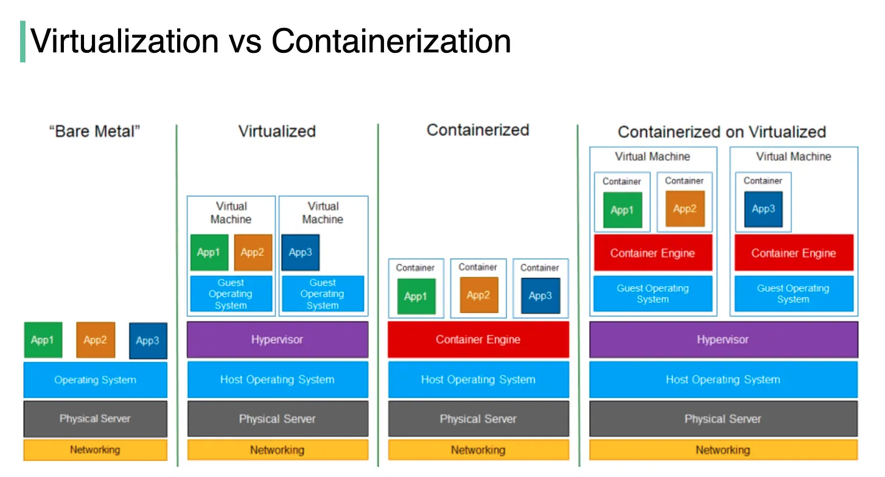

# docker

**What is Docker :**

- Docker is a set of platform as a service (PaaS) products that use OS-level virtualization to deliver software in packages called containers.   
- The software that hosts the containers is called Docker Engine.   
- It was first released in 2013 and is developed by Docker, Inc.    

Docker is a tool that is used to automate the deployment of applications in lightweight containers so that applications can work efficiently in different environments in isolation.

